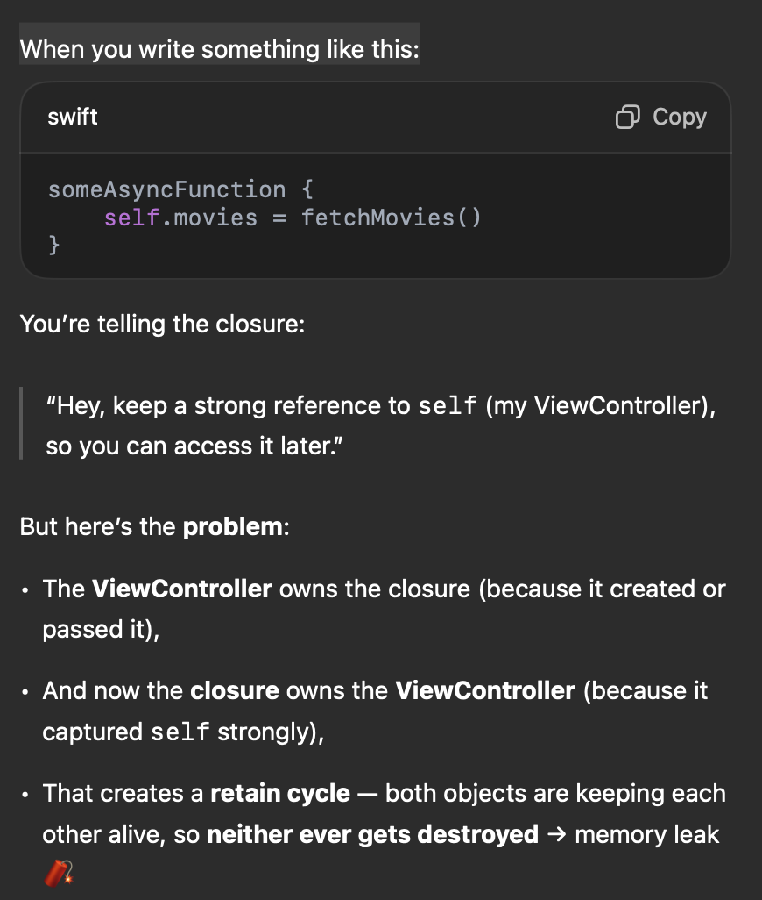
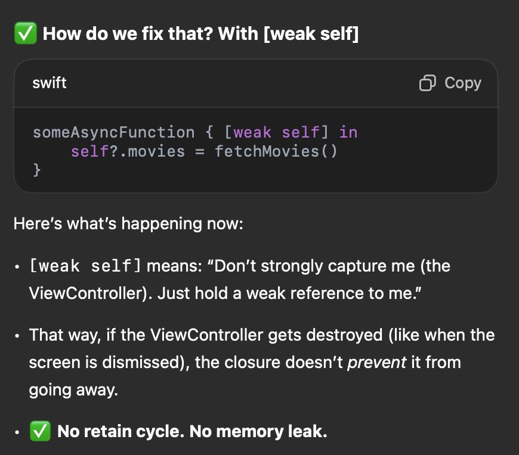

# Codepath IOS 101

Spring 2025 IOS development classwork / hw
WIP

# Table of Contents

## (2/20) lab1 mariokart starter

- installed xcode / introduced to xcode basics
- closure, trailing closure
- var, let (=constant)

## (2/26) project1 wordle starter
- `in` keyword: divider that tells Swift, “Everything before in is about what the closure takes in, and everything after is what the closure does.”
- using self is necessary because you're `accessing an instance property` (boardController) from within a closure defined in your ViewController class.
- `as!`: forced cast operator. Treat the returns cell as an instance of \_.
- `print("Random word: \(String(describing: randomWord))")`: creates a string rep of any given value. Works when value is `nil`.
- switch style {
case .initial:
blalabl
}
- `UIView`: basic building block for all user interface elements.
- `contentView`: subview with cell's primary content. So stying usually is modified for this.
- e.g. `contentView.backgroundColor = .black`
- every UIView has underlying Core Animations layer (CAlayer) that handles low-level rendering. I.e. Every UIView has `layer` property.
- if launch screen not working go to general -> target -> lanuch screen file add file name without the .storyboard.

## (2/27, 3/6) lab 2  mariokart part2 & proj 2 world starter

### Optionals & Typecasting
- `optionals`: add `?`. e.g. print(name) where `name is type String?` will output `Optional("johanna")`. It's sort of a wrapper.
- `!` force unwraps it. But beware of: `Fatal error: Unexpectedly found nil while unwrapping an Optional value`: **force-unwrapping an optional value containing nil will crash the app!** so use it only when you're sure it absolutely exists.
- better way - ***optional-binding***: `if let var = function(){ func2(var)}` var is now only accessible inside the `if-let` curly brace. 
- if we want to run func2 when var is nil, we can use the `guard` control-flow statment. `guard let var = func() else {fun2(var) assertionFailure() return} print("this will run if var is not nil!")`.
- comma acts like a logical AND

## (3/12, 3/14) lab 3 cloudcast & project 3 trivia app
- `viewcontroller`: manages specific screen/view (ui)
    - labels, buttons, text fields
    - logic for user interactions
-  `interface builder`: visual tool that comes with Apple's Xcode dev env. Devs can create and layout graphical UIs using drag and drop components.
- `view controller scene`: allows you to keep track of elements being added to view controller. 
- `autolayout constraints`: specify how elements in UI should be arranged relative to another / how they should respond to changes in screen size/orientation.  
- `stack view`: UI element that arragnes its subviews in a stack. 
- `let alert = UIAlertController()`, `self.present(alert, animated: true, completion: nil)` for alerts.

## (3/24) lab 5 cloudcast api &
- `URLSession` library to fetch data
- Deserialization: transforming bytes from network to type. We can use JSON response as a regular dictionary. 
- must execute code that modifies UI on main thread. API calls can be done on background thread.
- Think of the main thread as the person in charge of painting pictures (the user interface). Meanwhile, a helper goes off to do some chore (fetch data) in the background. When the helper finishes, they hand the results back to the painter, who is the only one allowed to paint on the canvas (the screen). DispatchQueue.main.async is like tapping the painter on the shoulder and saying, “Hey, here are the new colors; paint them now!”

## (4/2) lab 6 tumbler table view
- protocol: rule book. `UITableViewDataSource` is a protocol that says "if you want to be my data source, you must provide me the data for each row(cell) in the table"
- `[weak self]` and `self?` inside closure
    - 
    - 
- `main thread`
- table view doesn't know movies changed (after initialized as []), so it doesn't reload itself, we need to explicitly do that.
- wrap to as many lines as it has room for: `lines` property 0. 